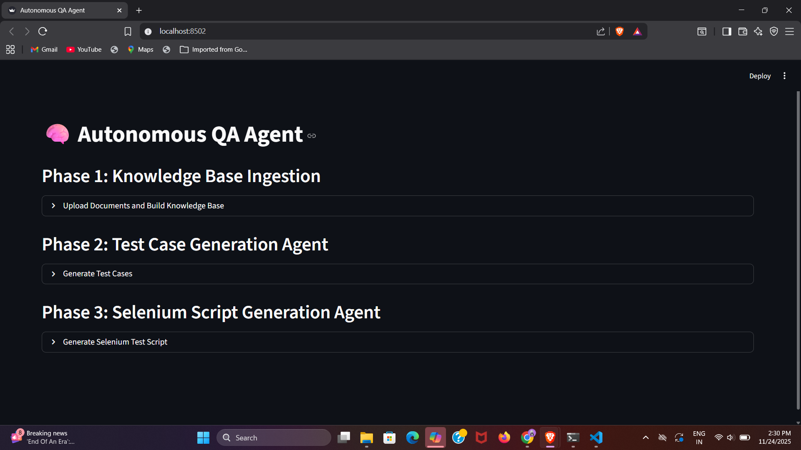
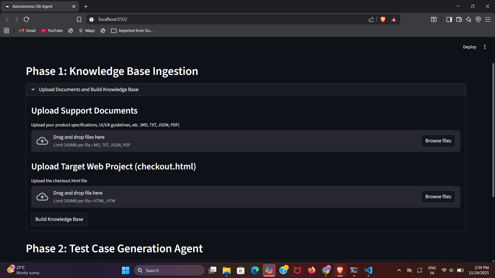
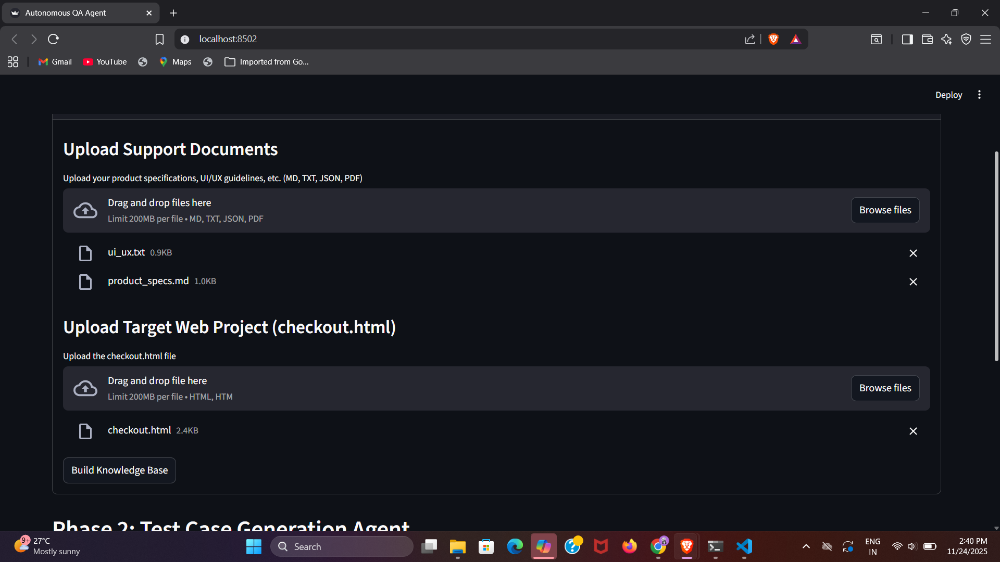
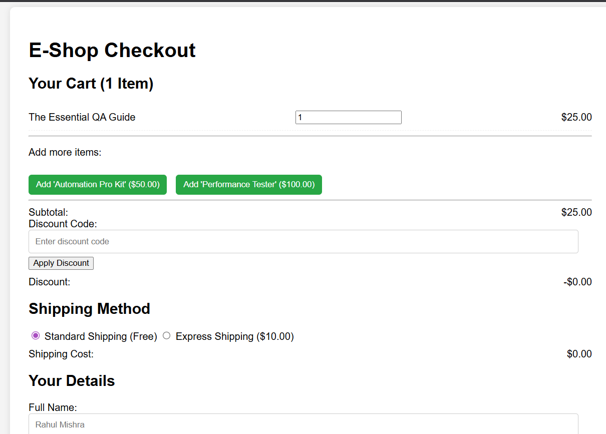
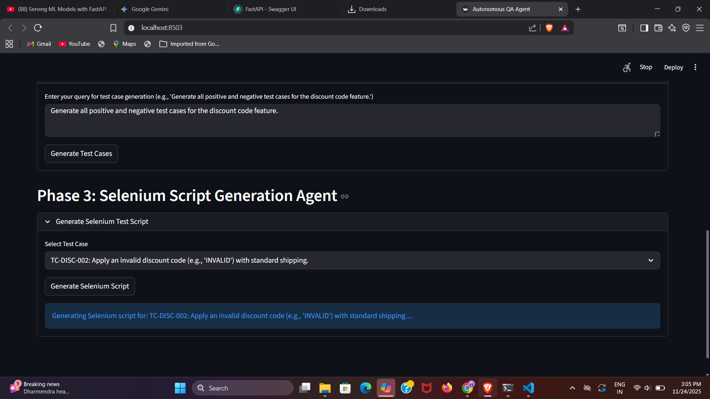
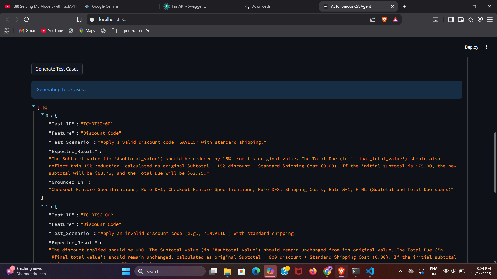
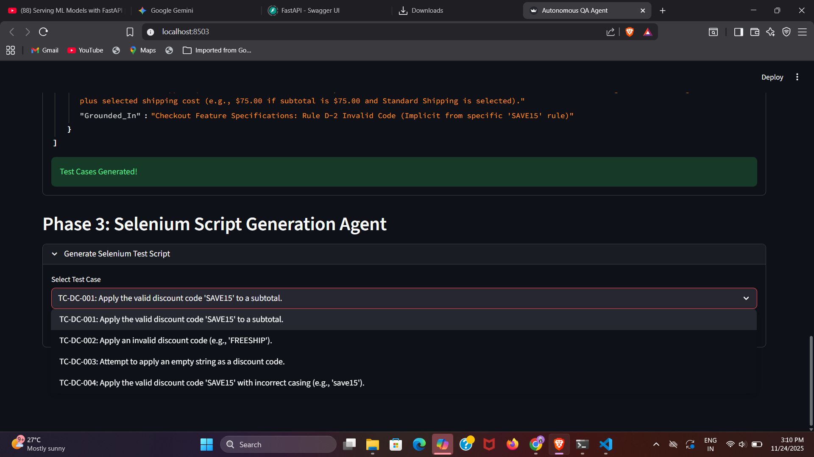
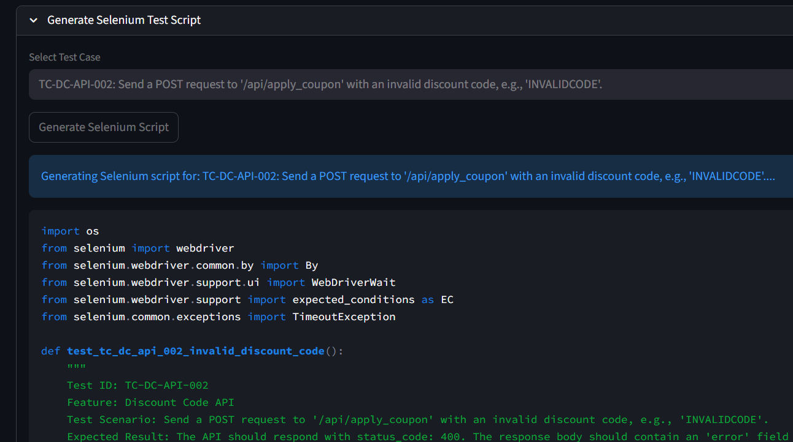

# Autonomous QA Agent

This project implements an intelligent, autonomous Quality Assurance (QA) agent that leverages Retrieval-Augmented Generation (RAG) to translate project documentation and web page structure into executable Selenium test scripts. The system constructs a "Testing Brain" from provided support documents, ensuring all generated tests are non-hallucinatory and grounded strictly in the specifications.

The application is split into two components: a FastAPI backend for the heavy lifting (RAG pipeline, LLM orchestration) and a Streamlit frontend for the interactive user interface.

The agent performs two core functions:

Test Case Generation: Converts natural language queries and documentation rules into structured, human-readable test cases (e.g., Markdown tables).

Selenium Script Generation: Translates the generated test cases into robust, executable Python Selenium scripts.

## Project Assets
[`data/`](./data)

## Demo Video 
[Video link](https://drive.google.com/file/d/1J1cg4mjYzsTjLr8sIbLW1ngZEsFHrwLy/view?usp=drive_link)

## Features

*   **Knowledge Base Ingestion:** Upload and process various document types (Markdown, Text, JSON, PDF) and an HTML file (e.g., `checkout.html`) to build a comprehensive knowledge base.
*   **Test Case Generation:** Generate detailed test cases in JSON format based on user queries and the ingested knowledge. Each test case includes `Test_ID`, `Feature`, `Test_Scenario`, `Expected_Result`, and `Grounded_In` (source document).
*   **Selenium Script Generation:** Generate Python-based Selenium scripts for selected test cases, allowing for automated testing of web applications.

## Setup Instructions

### Python Version

This project is developed with Python 3.9+. It is recommended to use a virtual environment.

### Dependencies

1.  **Create a Virtual Environment (Optional but Recommended):**
    ```bash
    python -m venv venv
    ```

2.  **Activate the Virtual Environment:**
    *   **Windows:**
        ```bash
        .\venv\Scripts\activate
        ```
    *   **macOS/Linux:**
        ```bash
        source venv/bin/activate
        ```

3.  **Install Required Packages:**
    ```bash
    pip install -r requirements.txt
    ```
    (Note: If `requirements.txt` is not provided, you will need to infer the dependencies from `app.py`, `knowledge_base.py`, `parsers.py`, `test_case_agent.py`, and `selenium_agent.py` and install them manually. Key packages include `streamlit`, `python-dotenv`, `unstructured`, `pymupdf` (fitz), `langchain-text-splitters`, `transformers`, `torch`, `chromadb`, `google-generativeai`.)

4.  **Set up Gemini API Key:**
    Create a `.env` file in the `qa_agent_project/` directory with your Gemini API key:
    ```
    GEMINI_API_KEY='YOUR_GEMINI_API_KEY'
    ```

## How to Run the Application

This project primarily uses Streamlit for its user interface. There is no explicit FastAPI/Flask component mentioned in the provided files.

1.  **Activate your virtual environment** (if you haven't already).
2.  **Navigate to the project root directory** (where `app.py` is located).
3.  **Run the Streamlit application:**
    ```bash
    streamlit run qa_agent_project/app.py
    ```
    The application will open in your web browser, typically at `http://localhost:8501` (or another available port).
    

## Usage Examples

Once the Streamlit application is running:

### Phase 1: Knowledge Base Ingestion

1.  **Upload Support Documents:**
    *   Click "Upload your product specifications, UI/UX guidelines, etc."
    *   Select files like `data/product_specs.md`, `data/ui_ux.txt`, `data/api_endpoints.json` (these are example files included in the project).
    
    
2.  **Upload Target Web Project:**
    *   Click "Upload the checkout.html file".
    *   Select `data/checkout.html` (an example HTML file).
    

3.  **Build Knowledge Base:**
    *   Click the "Build Knowledge Base" button.
    *   Wait for the "Knowledge Base Built!" success message.
       

### Phase 2: Test Case Generation Agent

1.  **Enter your query:**
    *   In the text area, enter a query like: "Generate all positive and negative test cases for the discount code feature based on the product specifications and checkout page HTML."
    
2.  **Generate Test Cases:**
    *   Click the "Generate Test Cases" button.
    *   The generated test cases will appear in JSON format.
     
     
     

### Phase 3: Selenium Script Generation Agent

1.  **Select Test Case:**
    *   Choose a generated test case from the dropdown menu.
    
2.  **Generate Selenium Script:**
    *   Click the "Generate Selenium Script" button.
    *   The Python Selenium script for the selected test case will be displayed.
     
     

## Explanation of Included Support Documents

The [`data/`](./data) directory contains example support documents used to demonstrate the Knowledge Base capabilities:

*   **`data/product_specs.md`:** Markdown file containing product specifications. This would typically detail features, requirements, and business logic.
*   **`data/ui_ux.txt`:** Text file outlining UI/UX guidelines. This helps the agent understand design principles and expected user interactions.
*   **`data/api_endpoints.json`:** JSON file listing API endpoints. This provides structural data that could be relevant for backend testing aspects.
*   **`data/checkout.html`:** An example HTML file representing a web page, such as a checkout process. This allows the agent to analyze the DOM structure for UI automation with Selenium.
